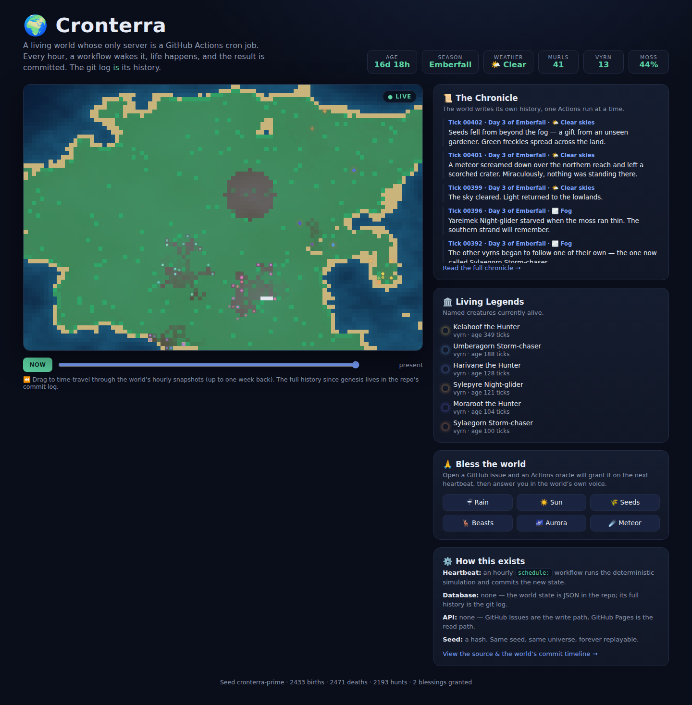

# 🌍 Cronterra

**A persistent living world whose only server is GitHub Actions.**

There is no backend. There is no database. There is no API service. There is a repository — and every hour, a `schedule:` workflow wakes the world up, life happens, and the result is committed. Cronterra has been alive since its first heartbeat, and its entire history — every storm, every birth, every named creature's death — is the git log.



## What is this?

Cronterra is an ecosystem simulation that lives *inside* GitHub's infrastructure, using each part of the platform as a different organ:

| GitHub feature | Role in the world |
|---|---|
| **Actions cron** | The heartbeat. One run per hour = one world-hour. Seasons last a real week. |
| **Git commits** | Time itself. Every tick is a commit; `git log` is the world's complete timeline. |
| **GitHub Pages** | The window. A canvas viewer renders the live world with weather, day/night, and a time-travel scrubber. |
| **GitHub Issues** | The prayer system. Open an issue titled `bless: rain` and an oracle workflow grants it, answers in the world's voice, and closes the issue. |
| **The seed** | A hash. The simulation is fully deterministic — same seed, same universe, replayable forever. |

### The world itself

- **Terrain** is generated from seeded value noise: an island chain with coasts, lowlands, crags, and snowcaps.
- **Weather** is a season-aware state machine — rain, storms, droughts, snow, fog, and the occasional night aurora — that drives a moisture/hydrology layer.
- **Moss** (flora) grows with moisture and season, spreads by spores, and dies back in droughts.
- **Murls** graze the moss; **vyrn** hunt the murls. Both carry mutating genomes (speed, metabolism, hue — the hue is what you see glowing on the map), so populations drift and adapt over generations.
- **Named legends**: notable creatures earn generated names — *Kelahoof the Hunter*, *Umberagorn Storm-chaser* — and their lives and deaths are recorded in [the Chronicle](world/chronicle.md), a prose history the world writes about itself on every run.
- **Failsafes**: if life collapses, migrants wander "in from beyond the fog." The world can suffer, but it refuses to die.

### Blessings

Anyone can intervene by opening an issue (the viewer has one-click buttons):

`bless: rain` · `bless: sun` · `bless: seeds` · `bless: beasts` · `bless: aurora` · `bless: meteor` ☄️

The oracle workflow applies it on an immediate extra heartbeat, commits the consequences, and replies before closing the issue. Yes, the meteor is real. Yes, it has killed named creatures. The Chronicle remembers who asked for it.

## Running it

**Setup:** none, ideally — the workflows try to enable GitHub Pages themselves (`actions/configure-pages` with `enablement: true`). If your org's policy blocks that, flip it once by hand: Settings → Pages → Source: **GitHub Actions**. With the workflows on the default branch, the cron starts beating and the world comes alive at `https://<owner>.github.io/<repo>/`.

**Locally:**

```bash
node engine/cli.js genesis --seed=my-universe   # create a world (zero dependencies)
node engine/cli.js tick --count=500             # fast-forward 500 hours
node engine/cli.js tick --bless=meteor          # play god
node engine/cli.js status

# view it
mkdir -p _site && cp -r web/. _site/ && cp -r world _site/world
cd _site && python3 -m http.server 8080         # open http://localhost:8080
```

**Manual heartbeat:** the *🫀 World Heartbeat* workflow has a `workflow_dispatch` with a tick count (time compression) and an optional blessing.

## Repo layout

```
engine/     deterministic simulation + CLI (pure Node, zero deps)
web/        static canvas viewer (no build step, no framework)
world/      the living state: state.json, hourly snapshots, chronicle.md
.github/workflows/
  heartbeat.yml   hourly cron: tick → commit → deploy
  oracle.yml      issue-ops: parse blessing → apply → reply → close
  pages.yml       deploy viewer on ordinary pushes
```

## Why this is different

Most "apps built with GitHub Actions" use Actions as CI. Cronterra uses Actions as **runtime**: the scheduler is the game loop, the repo is the save file, issues are the input device, and Pages is the display. Delete the cron and the world freezes mid-breath, perfectly preserved in its own commit history — clone the repo and you're holding a fossil of an entire universe, replayable from any commit.
